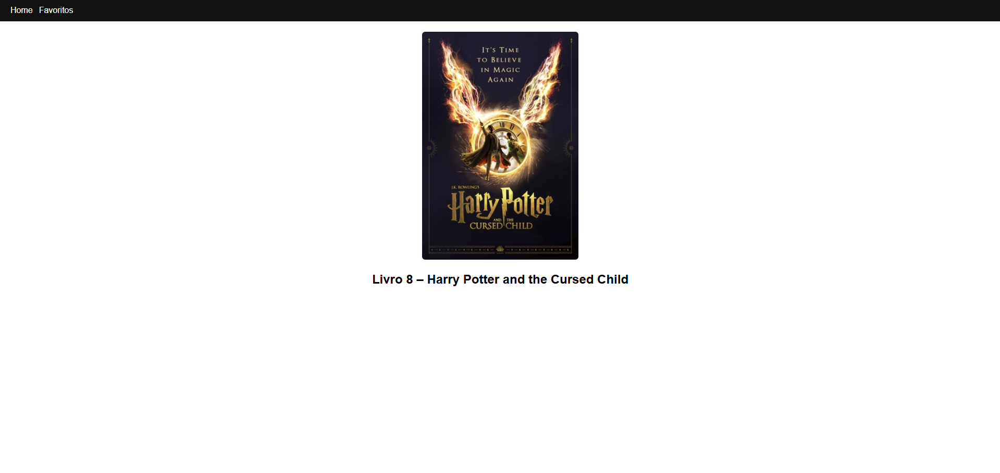
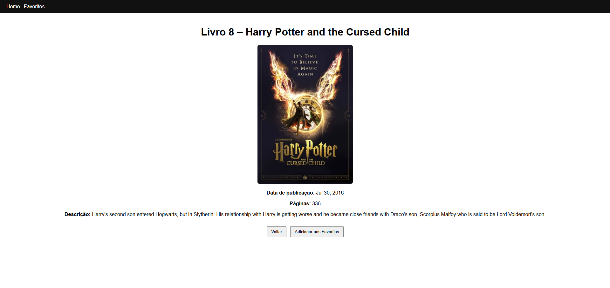

📚 React Vercel App – Harry Potter Books

Aplicação desenvolvida para a disciplina Frontend Frameworks, seguindo todos os requisitos definidos pelo professor João Ferreira.
O objetivo é consumir uma API pública de livros de Harry Potter, exibir um livro aleatório, permitir visualizar detalhes e favoritar livros com persistência local.

🚀 Tecnologias Utilizadas

React 18

Vite 7

React Router DOM

LocalStorage

Node.js 20.19.x

Vercel (Deploy)

📁 Funcionalidades
🏠 Tela Inicial (Home)

Busca automaticamente um livro aleatório da API ao abrir a aplicação.

Exibe capa, número e título original.

Ao clicar na capa → navega para a Tela de Detalhes.

Ao retornar da Tela de Detalhes → carrega um novo livro aleatório.

📖 Tela de Detalhes

Exibe:

Número do livro

Título original

Data de publicação

Número de páginas

Descrição

Botão Voltar → retorna à Home e carrega um novo livro.

Botão Adicionar aos Favoritos → salva no LocalStorage e alerta o usuário da ação.

⭐ Tela de Favoritos

Lista todos os livros salvos anteriormente.

Persistência garantida mesmo após recarregar o navegador.

Exibe pelo menos o título do livro.

🔗 API Utilizada

API pública de livros de Harry Potter:
https://potterapi-fedeperin.vercel.app/en/books/random

Documentação:
https://github.com/fedeperin/potterapi

▶️ Como Executar Localmente
Instalar dependências:
npm install

Rodar em desenvolvimento:
npm run dev

Acesse: http://localhost:5173/

Gerar build de produção:
npm run build

🌐 Deploy (Vercel)

Aplicação publicada em:
👉 https://SEU-PROJETO.vercel.app

(substitua pela sua URL do Vercel)

🖼️ Screenshots
🏠 Tela Inicial (Home)

📖 Tela de Detalhes

⭐ Tela de Favoritos

📜 Licença

Este projeto está licenciado sob Creative Commons BY 4.0.
Arquivo LICENSE incluído no repositório.